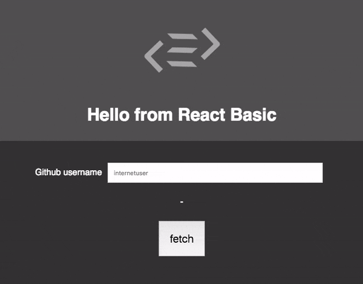

# Another Purescript React Basic Starter

[](https://travis-ci.org/danieljharvey/another-react-basic-starter)

### What is it?



### Aims

This is a basic starter for Purescript React Basic that intends to have just enough features to tinker with and demonstrate that React Basic with Purescript is a pretty OK way to make web apps.

As well as the `react-basic` package it uses `affjax` for fetching content, `simple-json` for decoding json data, and `test-unit` for unit tests. You can bin all this other stuff if you like, it is merely there because it is what I prefer.

I would not take this repository as an example of idiomatic Purescript development (I would not consider myself experienced enough to really know what that is), however hopefully it should be enough to get an interested beginner on their feet and making/breaking things.

### Getting Started

Download the repository:

```bash
git clone https://https://github.com/danieljharvey/spacchetti-react-basic-starter
```

Change to the exciting new folder you have created.

```bash
cd spacchetti-react-basic-starter
```

Install the Javascript dependencies (you can also use `npm` here, your funeral, etc)

```bash
yarn install
```

This will build all of the Purescript in the project (and more importantly, show you any errors)

```bash
yarn purs:build
```

This will run the app on a Parcel server, which you can view by navigating to `localhost:1234` in your browser.

```bash
yarn start
```

Note that Parcel somewhat swallows up your errors - so if you are making changes and not seeing anything - it is good to run `yarn purs:build` to see what's up.

Alternatively, you can run `pscid` in another window, which will show you errors and generally help you out as you develop.

```bash
yarn pscid
```

There are also some basic unit tests you can run with

```bash
yarn test
```

And once you are ready to share your creation with the world, you can make a static version with:

```bash
yarn purs:build
```

### What does all this rubbish do then?

#### Purescript

`purescript` is a Haskell-esq language that compiles to (amongst other things) Javascript.

<http://www.purescript.org/>

#### Psc-package

`psc-package` is a package manager for Purescript which uses sets of packages to ensure everything we use it going to work together. Conceptually it is similar to `Stack` used by Haskell.

<https://github.com/purescript/psc-package>

#### Pulp

`pulp` is a Purescript build tool that does a whole host of good things (and has a nice GIF of Jarvis Cocker dancing on it's github). It is used here for running the unit tests.

<https://github.com/purescript-contrib/pulp>

#### Parcel

`parcel` is a zero-config web app bundler. It is used here to smash everything together and put it in a browser.

<https://github.com/parcel-bundler/parcel>

#### Test-unit

`test-unit` is a Purescript test runner that let's us do async tests and other good things.

<https://github.com/bodil/purescript-test-unit>

#### Simple-json

`simple-json` is a package for converting to and from JSON, without having to do very much work, which I thoroughly approve of.

<https://github.com/justinwoo/purescript-simple-json>

#### Affjax

`affjax` is a Purescript library for making AJAX calls.

<https://github.com/slamdata/purescript-affjax>

#### Pscid

`pscid` is a Purescript file watcher that is pretty handy for checking type errors as you work. I create quite a lot of these so this is pretty essential.

<https://github.com/kRITZCREEK/pscid>

### History

This is a fork of [spacchetti-react-basic-starter](https://github.com/justinwoo/spacchetti-react-basic-starter), which is in turn a fork of the original [LumiHQ/React-Basic-Starter](https://github.com/lumihq/react-basic-starter).

It removes the Nix stuff (as it's great, but a little overwhelming for a beginner) and added a more fully featured sample app to demonstrate that indeed, making (semi) nice things is possible with this setup.
